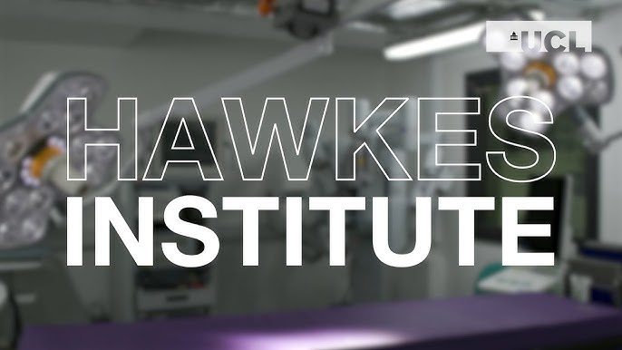
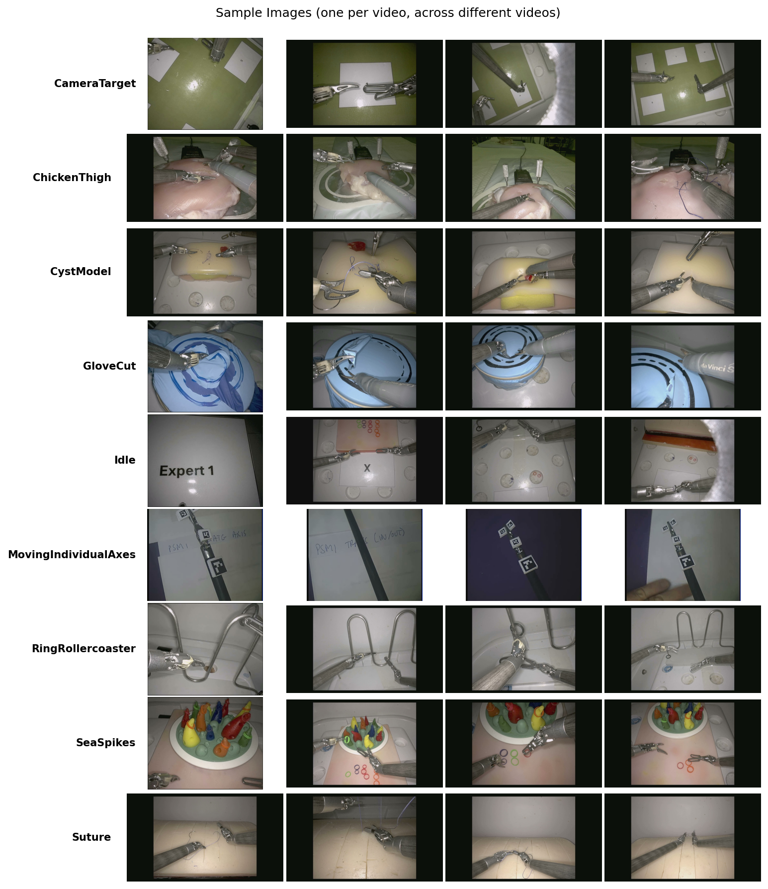
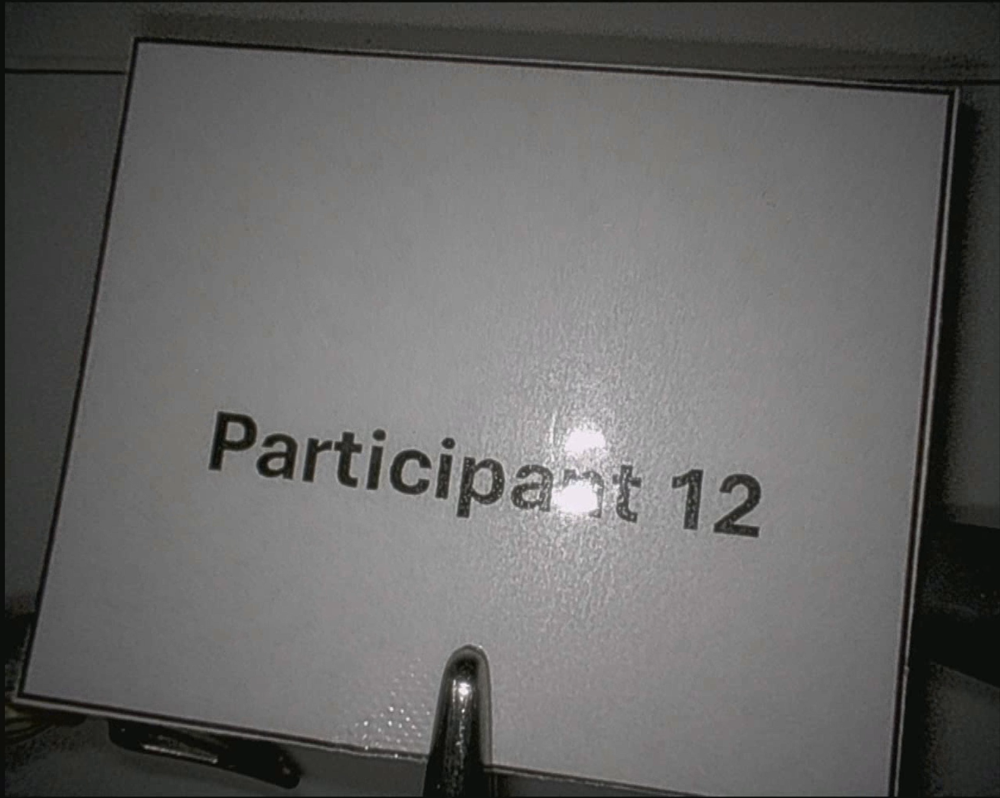
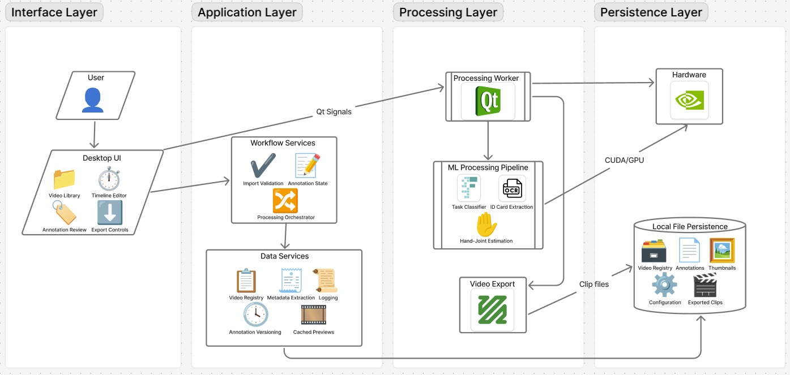
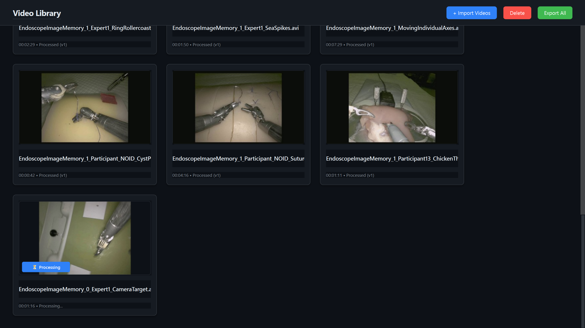
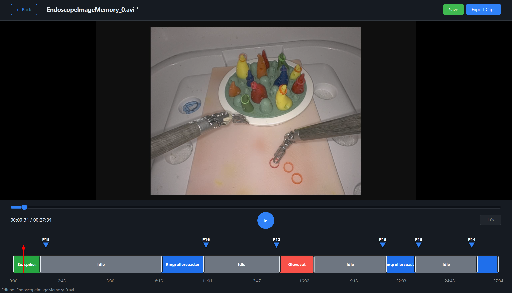

<p align="center">
  
</p>

# Surgical Video Analysis Pipeline

A desktop application for analysing surgical training videos. It uses a deep learning classifier to automatically segment videos into task types (suturing, glove cutting, etc.), detects participant/expert identification cards via OCR, and lets you manually refine the annotations before exporting individual clips.

Built with PyQt6 and Python 3.12.

## What it does


1. **Import** videos into a library with auto-generated thumbnails
2. **Process** them through a task classifier (ResNet50 via fast.ai) and a participant detector (EasyOCR)
3. **Review and edit** annotations on an interactive colour-coded timeline
4. **Export** labelled video clips split by task segment

## Setup

### Prerequisites

- Windows 10+
- Python 3.12+
- A CUDA-capable GPU is recommended but not required - the app falls back to CPU

### Install

```bash
# Clone the repo
git clone https://github.com/meyer6/COMP0016_2025_Team18_Hawkes_Data_Pipeline.git
cd COMP0016_2025_Team18_Hawkes_Data_Pipeline

# Create and activate a virtual environment
python -m venv .venv

# PowerShell
.venv\Scripts\Activate.ps1

# Or cmd
.venv\Scripts\activate.bat

# Install dependencies
pip install -r requirements.txt

# Reinstall PyTorch with the correct build (pick one)
# GPU (NVIDIA with CUDA 12.6)
pip install "torch>=2.1.0,<2.7" "torchvision>=0.16.0,<0.22" --index-url https://download.pytorch.org/whl/cu126 --force-reinstall --no-deps
# CPU only
pip install "torch>=2.1.0,<2.7" "torchvision>=0.16.0,<0.22" --index-url https://download.pytorch.org/whl/cpu --force-reinstall --no-deps
```

### Run

```bash
python main.py
```

The app opens a grid-based library view. From there you can import videos, queue them for processing, open the editor to tweak annotations, and export clips.

## Configuration

You can drop a `config.json` in the project root to override defaults. All fields are optional - anything you leave out uses the default.

```json
{
  "model_path": "processing/models/task_classifier.pkl",
  "sample_every": 30,
  "smoothing_window": 15,
  "min_duration_sec": 5,
  "confidence_threshold": 0.5,
  "enable_gpu_acceleration": true,
  "log_level": "INFO"
}
```

| Field | Default | Description |
|-------|---------|-------------|
| `sample_every` | 30 | Process every Nth frame (30 = ~1fps at 30fps video) |
| `smoothing_window` | 15 | Temporal smoothing window for predictions |
| `min_duration_sec` | 5 | Minimum segment length in seconds |
| `confidence_threshold` | 0.5 | Prediction confidence cutoff |
| `enable_gpu_acceleration` | true | Use CUDA if available |
| `log_level` | INFO | Logging verbosity (DEBUG, INFO, WARNING, ERROR) |

## Testing

```bash
# Run the full suite
pytest

# Unit tests only
pytest -m unit

# Integration tests only
pytest -m integration

# With coverage report
pytest --cov=app --cov-report=html
```

Coverage targets 100% on core logic (services, models, repositories, config). UI components (views, widgets) are excluded from the coverage requirement.

Tests run automatically on every push and PR via GitHub Actions. The CI uses headless PyQt with xvfb and CPU-only PyTorch to keep things fast.

## ML Models

The system uses two ML models working in sequence to analyse videos:

### Task Classifier

A fine-tuned **ResNet50** CNN (via fast.ai) that classifies video frames into nine surgical task types:
- CameraTarget, ChickenThigh, CystModel, GloveCut, Idle, MovingIndividualAxes, RingRollercoaster, SeaSpikes, Suture

The model was trained on 42,155 labelled frames across 56 videos and achieves **98.41% validation accuracy**. It samples frames at configurable intervals (default: every 30th frame, ~1 fps at 30fps video), applies temporal smoothing to reduce noise, and enforces minimum segment durations to produce clean, contiguous task segments.



*Sample frames from each task class*

### Participant Detector

An **EasyOCR**-based pipeline that reads participant and expert identification cards held up to the camera. Uses fuzzy matching with Levenshtein distance to handle OCR errors (e.g., "particlpant" → "participant"). Session-based majority voting provides robust detection across multiple frames.



*Example participant identification card*

### Performance Summary

| Component | Metric | Value |
|-----------|--------|-------|
| **Task Classifier** | Accuracy | 98.41% on held-out validation videos |
| | Processing Speed | ~49 min footage / min (NVIDIA RTX 4060) |
| | Dataset | 42,155 frames, 56 videos, 9 classes |
| **Participant Detector** | Detection Rate | Near-perfect on reviewed test cases |
| | Processing Speed | ~20 min footage / min |
| | Engine | EasyOCR with fuzzy matching |
| **Overall Pipeline** | End-to-end Speed | 2.6 hours footage → 11 min processing |
| | GPU/CPU | CUDA with automatic CPU fallback |
| | Memory | Dynamic batch size based on available VRAM |

## Architecture notes



The codebase follows a layered architecture:

- **Domain** - pure data models and result types, no framework dependencies
- **Infrastructure** - repositories (JSON-backed with in-memory caching and atomic writes), video utilities, model loading
- **Services** - business logic for import, processing status, and export
- **Processing** - the ML pipeline: frame sampling, classification, temporal smoothing, OCR detection, memory-aware batching
- **UI** - PyQt6 views and widgets, with QThread workers to keep the interface responsive during processing

Dependency injection is handled by a `ServiceContainer` that wires everything together at startup. Annotations are versioned (`_v1.json`, `_v2.json`, ...) so edits don't destroy previous results.

## Tech stack

- **GUI:** PyQt6
- **Video:** OpenCV, FFmpeg
- **ML:** PyTorch, fast.ai (ResNet50), EasyOCR
- **Data:** pandas, NumPy
- **Testing:** pytest + pytest-cov
- **CI:** GitHub Actions

## Screenshots

**Video Library**


**Video Editor**

